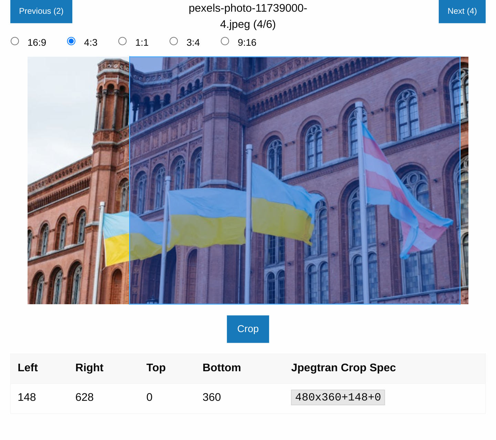

# JPEGtran Web

A simple web application for losslessly cropping JPEG images using `jpegtran`.
It also uses `rdjpgcom` for getting the image dimensions.

Both programs are included in libjpeg.
On ubuntu you can install the package `libjpeg-turbo-progs`.

## Usage

* Install frontend requirements with `npm install`.
* Install backend requirements with `poetry install`.
* Build frontend with `npm run build` (will build into `dist` which is linked from `backend/static`).
 * Alternatively you can also start the development server with `npm run dev`.
* Run server with `poetry run python -m flask --app backend.app run`.
* Navigate with your browser to `http://localhost:5000` (in case of running the vite development server: the URL printed in the shell).
* It will create the folder `~/.jpegtranweb/collection`. Put your images in there. They will be overwritten when you crop.

## Features

* Draggable crop box to interactively select the area you want to crop.
* Optimized for finding the maximum cropping area for the given aspect ratio.
* Select from common aspect ratios: 4:3, 16:9, 1:1 (portrait and landscape).
* Keyboard shortcuts for completely mouseless operation (as an alternative).
* Preserve timestamps and EXIF data.

## Example Image Credit
Example image of Ukrainian flags beside Rotes Rathaus in Berlin from [Pexels](https://www.pexels.com/photo/ukrainian-flags-beside-rotes-rathaus-in-berlin-11739000/)
